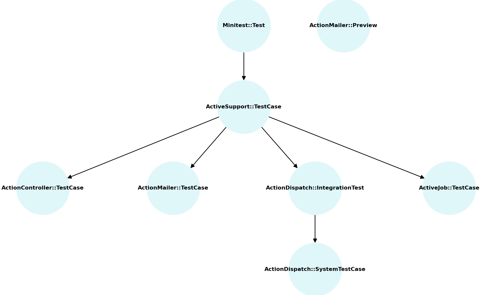

| Test Type         | Base Class                        | Purpose                   | Docs                                                                               |
| ----------------- | --------------------------------- | ------------------------- | ---------------------------------------------------------------------------------- |
| Unit/Models       | `ActiveSupport::TestCase`         | Models, POROs             | [Docs](https://guides.rubyonrails.org/testing.html#testing-models)                 |
| Controllers       | `ActionController::TestCase`      | Controller actions        | [Docs](https://api.rubyonrails.org/classes/ActionController/TestCase.html)         |
| Mailers           | `ActionMailer::TestCase`          | Email sending logic       | [Docs](https://api.rubyonrails.org/classes/ActionMailer/TestCase.html)             |
| Mailer Preview    | `ActionMailer::Preview`           | Preview emails in browser | [Docs](https://guides.rubyonrails.org/action_mailer_basics.html#previewing-emails) |
| Integration       | `ActionDispatch::IntegrationTest` | Multi-step HTTP flows     | [Docs](https://guides.rubyonrails.org/testing.html#integration-testing)            |
| System (Capybara) | `ActionDispatch::SystemTestCase`  | Full browser tests        | [Docs](https://guides.rubyonrails.org/testing.html#system-testing)                 |
| Jobs              | `ActiveJob::TestCase`             | Background jobs           | [Docs](https://api.rubyonrails.org/classes/ActiveJob/TestCase.html)                |

### Hierarquia das Classes de Teste no Rails (Minitest)

  
_Figura: Diagrama mostrando a hierarquia entre as principais classes de teste do Rails utilizando Minitest._
